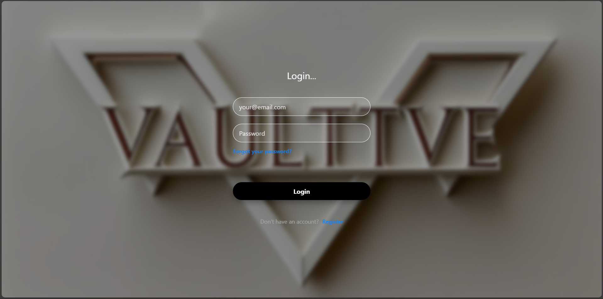
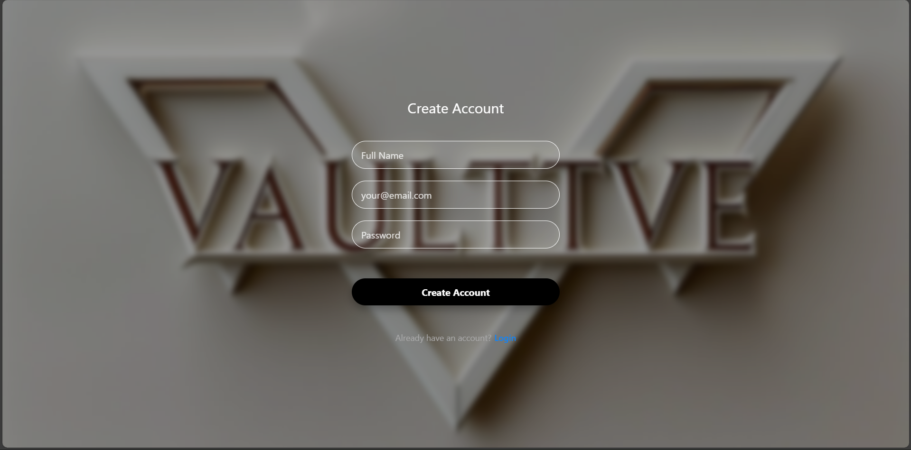
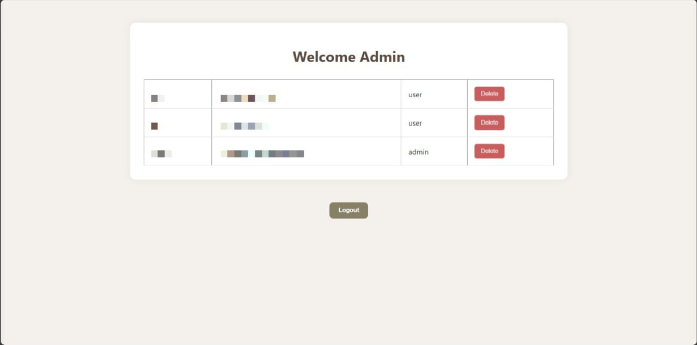
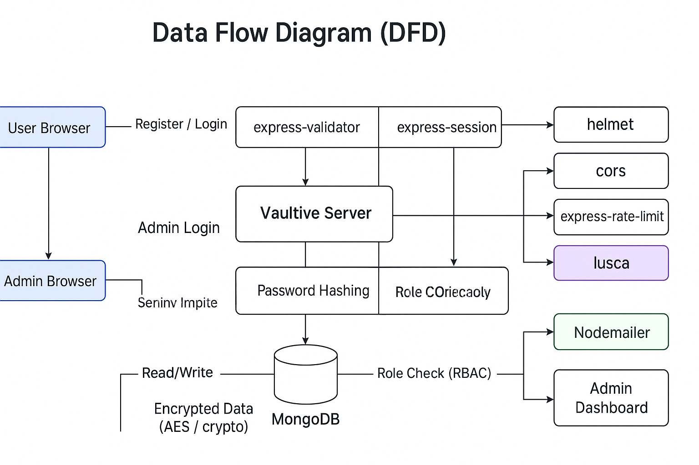

#  Vaultive – Secure Web Agency Platform


##  Description

Vaultive is a professional web agency platform designed with security-first principles.

It combines modern web development technologies with robust security measures to deliver a secure, fast,

and user-friendly experience for clients, administrators, and developers alike.


---


## Tech Stack


 - **Frontend:**

 [](https://developer.mozilla.org/en-US/docs/Web/HTML)

 [](https://developer.mozilla.org/en-US/docs/Web/CSS)

- **Backend:**

 [](https://nodejs.org/)

 [](https://expressjs.com/)

- **Database:**

 [](https://www.mongodb.com/)

- **Authentication:**

  [](https://www.npmjs.com/package/express-session)

  [](https://www.npmjs.com/package/bcrypt)

  [](https://www.npmjs.com/package/helmet)

  [](https://www.npmjs.com/package/cors)

  [](https://www.npmjs.com/package/express-validator)

  [](https://www.npmjs.com/package/express-rate-limit)

  [](https://www.npmjs.com/package/body-parser)

  [](https://www.npmjs.com/package/lusca)

  [](https://nodejs.org/api/crypto.html)

- **Email Notifications:**

  [](https://www.npmjs.com/package/nodemailer)

- **Input Validation/Sanitization:**

  [](https://github.com/cure53/DOMPurify)

  [](https://www.npmjs.com/package/validator)

- **Dev Tools:**

  [](https://www.npmjs.com/)

  [](https://git-scm.com/)

  [](https://code.visualstudio.com/)

- **Security Testing:**

  [](https://securitylab.github.com/tools/codeql)

- **Deployment:**

[](https://vercel.com/)


---

## Project Overview


**Vaultive** is a secure web agency platform designed with **security-first principles**. It offers modern web functionalities while protecting sensitive user data and administrative controls.


Key objectives:

- Secure registration/login and profile management

- Admin dashboard with role-based access

- MFA and password reset with cryptographically secure tokens

- Robust protection against XSS, CSRF, session hijacking, and privilege escalation


---

## Features


- **User Registration and Login:** Secure signup and authentication for both Admin and User roles.

- **Password Hashing using `bcrypt`:** All passwords are hashed before storing in the database for maximum security.

- **Input Validation using `express-validator`:** Server-side validation for forms to prevent malicious inputs.

- **Output Sanitization using `DOMPurify`:** Client-side protection against XSS attacks.

- **AES Encryption for Sensitive Data using `crypto`:** Optional encryption for sensitive user information stored in MongoDB.

- **Role-Based Access Control (RBAC):** Admin and User have separate privileges; enforced server-side on all protected routes.

- **Session Management with Secure Cookies:** HttpOnly, Secure, and SameSite flags; sessions are regenerated after login.

- **Multi-Factor Authentication (MFA):** Optional TOTP-based MFA using Google Authenticator for sensitive accounts.

- **Password Reset Tokens:** Cryptographically secure, single-use, time-limited tokens for password recovery.

- **Rate Limiting and CAPTCHA Protection:** Prevent brute-force login attempts and DoS attacks on sensitive endpoints.

- **STRIDE Threat Modeling:** Threat identification and mitigation planning applied to all routes and functionalities.

- **DREAD Risk Assessment:** Quantitative risk scoring to prioritize security fixes and threat mitigation.

- **Security Headers using `helmet`:** Enforces HTTP headers to protect against well-known web vulnerabilities.

- **CORS Policy:** Configured using `cors` middleware to allow secure cross-origin requests.

- **Input Sanitization & Secure Coding Practices:** Full-stack input validation, output sanitization, and avoidance of unsafe functions.

- **Email Notifications via `Nodemailer`:** Securely sends account-related emails (e.g., password reset, MFA verification).

- **Session-Based Authentication:** User sessions maintained securely on the server.

- **Audit Logging:** Logs user actions like login, logout, and profile changes for accountability.

- **Code Scanning \& Dependency Auditing:** Periodic checks using `npm audit`, OWASP ZAP, and other security tools to detect vulnerabilities.

- **Responsive Design:** Fully responsive frontend that works seamlessly on desktop and mobile devices.

- **Admin Dashboard:** Secure interface for managing users, monitoring activity, and site content.


---


## Security Implementations


| Category               | Implementation
|------------------------|-------------------------------------------------
| Authentication         | session-based
| Authorization          | Role-based access control
| Hashing \& Encryption  | bcrypt & AES for sensitive fields
| Input Validation       | validator.js
| Output Sanitization    | DOMPurify
| Session Management     | JWT expiry , secure cookies
| Rate Limiting          | express-rate-limit
| CAPTCHA                | Google reCAPTCHA (on login/registration forms)
| CORS                   | Configured using `cors` module
| Headers                | Helmet for CSP, XSS protection


## Screenshots


**Login Page:**




**Register Page:**




**Reset Password Page:**


**Admin Dashboard Page:**




**Home Page:**


**Data Flow Diagram:**




##  Threat Modeling


- [STRIDE Threat Model](docs/STRIDE.md)

- [DREAD Risk Assessment](docs/DREAD.md)


##  Code Scanning Tools


Security tools used to scan and test the codebase:

- [ ] GitHub CodeQL

[code-scanning-files-extracted](docs/code-scanning-files-extracted.csv)

 


## Deployment


Link: https://vaultive-qw89ocjtt-amjads-projects-ff882369.vercel.app/


---


## Installation & Setup:

### Prerequisites


- Node.js >= 22.x

- MongoDB server

- npm >= 9.x


### Steps

1. Clone repository:

```bash


git clone https://github.com/amjad-altarefe/vaultive.git


cd vaultive


```


2. Install dependencies:

```bash


npm install


```


3. Create `.env` file:

```


PORT = 8080


SALT = <random number>


JWT_SECRET = <your_secret_key>


ENCRYPTION_KEY = <32_byte_hex_key>


IV_LENGTH = 15


MONGO_DB = <your_mongo_connection_string>


EMAIL_USER= <email_account>


EMAIL_PASS= <email_password>


CONTACT_TO= <email_account>


BASE_URL= http://localhost:8080


```


4. Start the server:

```bash


npm start


```


5. Access the platform:

```


http://localhost:8080


```

## Security Measures


- **Authentication & Session Security:** HttpOnly, Secure, SameSite cookies, optional MFA

- **CSRF Protection:** Using csurf middleware

- **XSS Prevention:** DOMPurify on frontend, validator.js & sanitize-html on backend

- **RBAC:** Server-side role checks for sensitive endpoints

- **Password Reset Tokens:** Cryptographically secure, single-use, time-limited

- **Logging & Monitoring:** Audit logs for login, logout, profile changes

- **Rate Limiting & DoS Mitigation:** Account lockouts, CAPTCHA, reverse proxy protections


---


## Usage


**Admin:**

- Manage users, content, and monitor logs via `/admin`


**User:**

- Register/login, update profile, enable MFA, access protected content


---


## 📛 Name Meaning


**Vaultive** is derived from the word **"Vault"**, symbolizing **security, protection, and safekeeping**, combined with the suffix **"-ive"**, suggesting **active functionality and innovation**.


The name reflects the platform's core mission:

> **Securing digital assets** for clients and users  

> **Providing innovative web solutions** with security-first principles  

> **Actively safeguarding sensitive data** and administrative controls  


In short, Vaultive represents a **secure, trustworthy, and dynamic web agency platform**.


---


## 📬 License


MIT License – Free to use and modify.


---


## 🧑‍💻 Author


Amjad Qandeel – Cybersecurity Expert

